<!--
author: yunfei
head:
date: 2016-04-04
title: 2048 自动算法 - Minimax & Alpha-Beta Pruning
tags: 2048,AI,algorithm
images:
category: algorithm
status: publish
summary:
-->

# 基础算法 - minimax

Minimax算法是解决两人对弈模型游戏的通用解决方案。2048游戏本质上也是一个两人对弈游戏——移动棋子的玩家和放置新棋子的电脑。

先来介绍一下minimax算法。minimax算法核心相当简单，仅有如下两条规则：

- 玩家每一步均选择使自己分数最大化（显而易见... 这就是算法的最终目的）
- 对手每一步均选择使玩家分数最小化（总是假设对手具有完美决策能力）

对于两人对弈游戏，双方的选择可以表示为一棵树，假如对于任何游戏，有如下的四步之内的选择树：（方块代表玩家，三角代表对手, 最下方的方块内数字代表最后的分数）

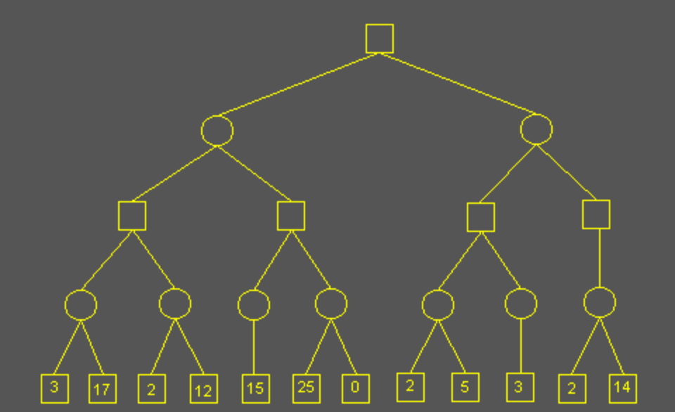

假设采用广度优先搜索，当第一次搜索时，对手在红字处做出选择，对手的选择是使玩家分数最小化，则在3和17中选择最小值 —— 3，这就是minmimax中的min：

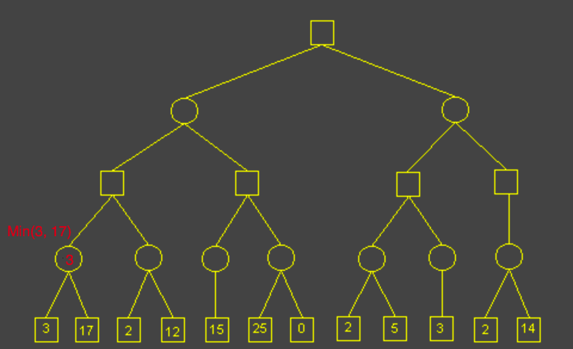

继续搜索，同样对于对手第二个选择节点，在2和12中选择最小值2：

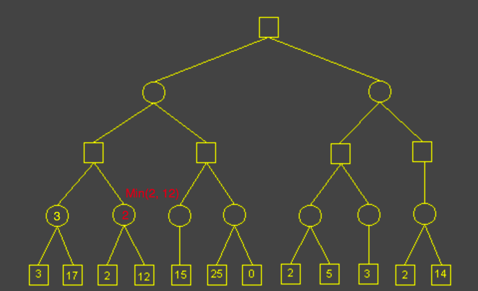

继续搜索，此时轮到玩家选择，玩家的选择是使自己分数对大化，则玩家在对手给予的两个最小值中选择一个最大值 —— 3，这就是minimax中的max：

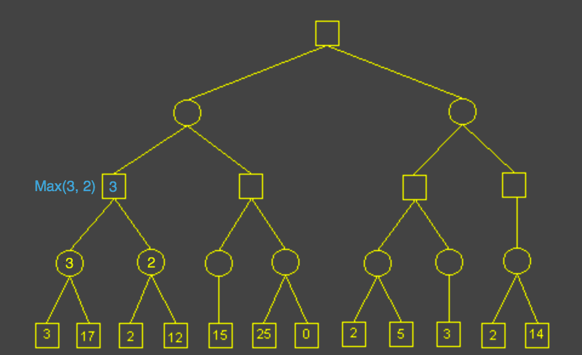

这就是minimax的全部内容。以后的每一步玩家和对手均作同样的选择。以下是剩余全部选择结果：

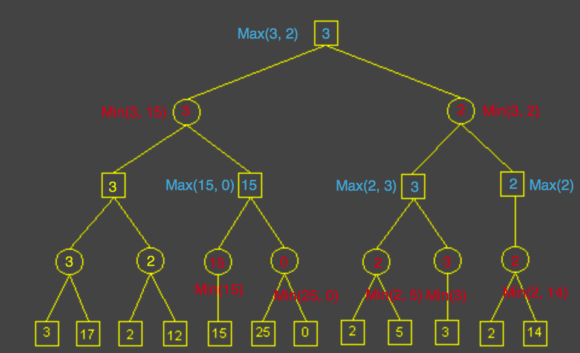

最终，玩家得出的结论是，当前状态下，**最坏情况**能达到的最高分数是3，这一步选择左侧路线。

mimimax总结：

- minimax是悲观算法，总是假设对手的决策是完美的
- minimax得出的不是对玩家来说的理论最优解，而是在对手完全没有失误的**最坏的情况下**，能获得的最高的分数 —— 也就是在对手导致的最小值中取一个最大值
- minimax计算的是局部最优解，因为实际情况中无法计算出所有的选择情况，因而只能考虑有限步数内能达到的最优解

# minimax算法效率优化 - Alpha-Beta Pruning（剪枝）

minimax算法总是搜索所有的选择情况，时间复杂度成指数级增加（假设每一步玩家有X种选择，对手有Y种选择，计算考虑N步，则计算复杂度为 O(XY^N) ）。使得计算效率非常低效，无法考虑足够深的计算步数，导致实际情况中计算得出的最优解不够好。

Alpha-Beta Pruning 是在minimax算法基础上的剪枝算法，通过跳过不必要的选择分支的搜索，达到提升minimax计算效率的目的。

Alpha-Beta Pruning 的核心思想如下：

- Alpha代表已知选择中玩家能达到的最优解（至少能达到的分数），Beta值代表已知选择中对手能达到的最优解（玩家最多能达到的分数）
- 对于选择树中某个轮到玩家选择的节点时，若在之前已知的选择策略中，对手可以选择使得玩家最多只能达到M分数（Beta值），则：
    - 如果玩家在这一步作出的某一个选择得到超过（或等于）M的分数时，**对手**因其最小值策略将不会考虑到达当前节点的选择，因而针对玩家当前节点的剩余选择的搜索是不必要的，可以剪枝跳过
- 反之，对于对手也是一样（考虑的是Alpha值）

同样对于这棵选择树：

采用深度优先搜索，从顶层往下遍历，初始设置跟节点的 alpha-beta 值为 -∞ ~ +∞，代表已知的双方最优解，每次向下搜索时向子节点传递该最优解，叶子节点其分数对应了alpha和beta值：

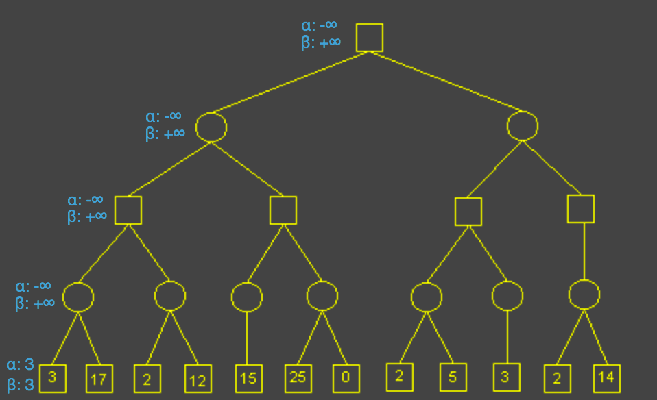

对手看到第一个选择节点时，取其alpha值（玩家选择最大值）尝试作为自己的beta值（对手选择最小值），这里子节点的alpha值（3）比对手当前的beta值（+∞）要小，所以更新对手的最优解：

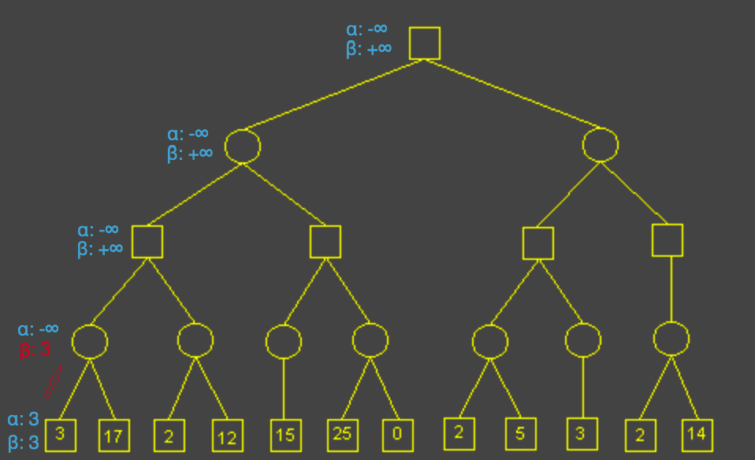

然后对手看到第二个选择节点，同样尝试取其alpha值，此时新的alpha值17比当前beta值3要大，不作更新

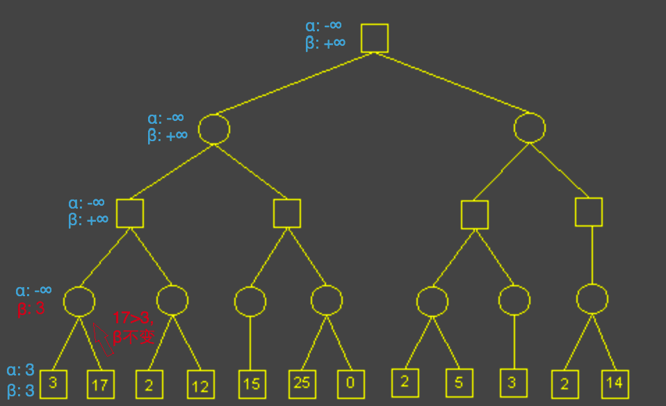

此时当前对手选择完毕，将结果更新到父节点，即玩家选择节点，玩家尝试将对手节点的beta值作为自己的alpha值，更新alpha值为3：

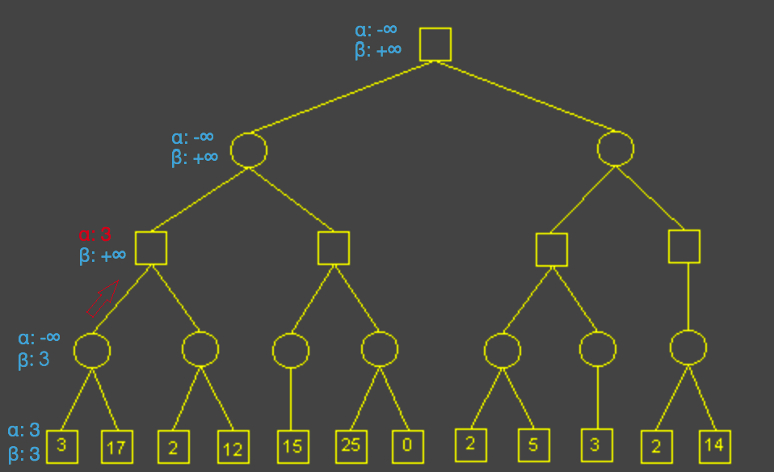

继续搜索下一子节点（对手选择节点），首先传递alpha-beta值：

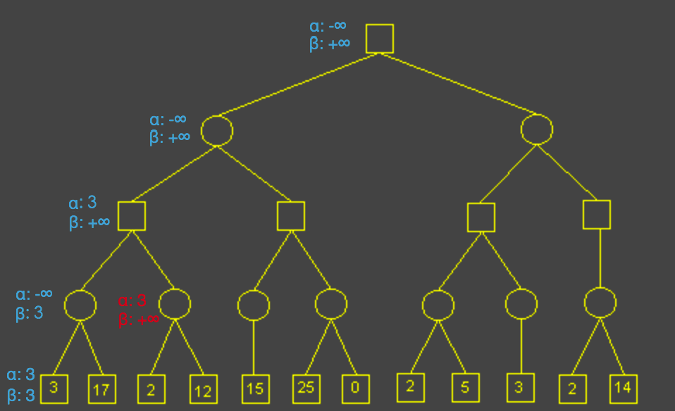

然后搜索对手的选择，此时对手发现在第一个选择中，其更新了新的beta值为2，这个对手能达到的最优解beta比玩家已知能达到的最优解alpha（3）还要小，那么玩家是不会做出选择到达这一步，因为如果做出了这样的选择，对手总是能让玩家的分数更低（或者说不会更高，如果此时beta值恰好等于alpha值）。这时，对手的其余选择已经没有意义 —— 反正也到不了这里。剪枝：

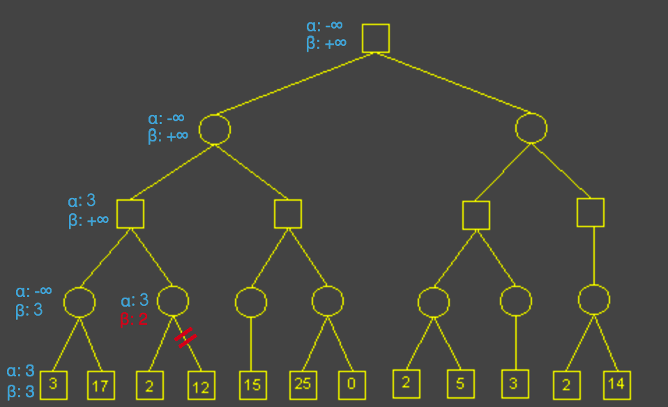

这就是alpha-beta的算法内容 —— 剪去因为不能达到更优解而不可能被选择的分支。

后续遍历结果：

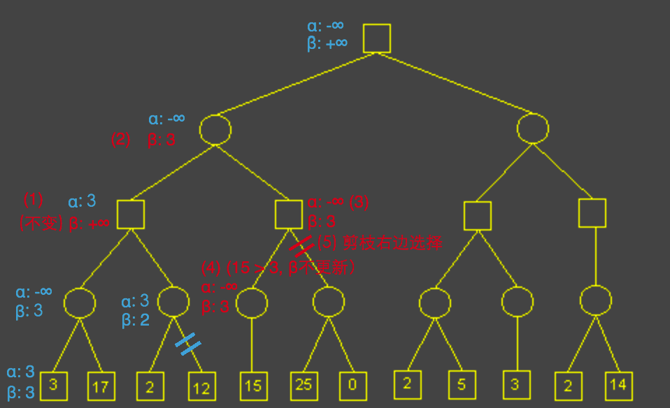

这里有一点与参考文章不一样的地方，把叶子节点同样纳入alpha-beta的通用计算中，而非特殊处理强制设置为叶子节点的分数值，此时(4)步骤后返回上一层父节点（玩家选择节点）尝试更新alpha值时，将发现新的alpha值等于beta值，（实际上新的alpha值就是父节点传下去的没有被更新的beta值）因而剪枝剩余选择。

这一点基于的假设是：

- 在当前玩家节点，如果传给子节点（即对手节点）的beta值没有被更新，是因为对手节点找不到比beta更优解，所以不更新beta值，因而会放弃到达此条分支

后续详细结果不做具体展示，可以根据算法自行推算。

Alpha-Beta Pruning 总结：

- alpha-beta 的计算结果跟minimax完全一致，仅仅只做不必要计算的剪枝
- alpha-beta 剪去的是对手或玩家因为无法在子树中找到更优解而放弃的选择
- alpha-beta 剪枝效率非常高，因为对于minimax的指数级复杂度来说，即便平均剪掉两层的计算步骤，也能减少相当多的计算成本。

# Minimax 以及 Alpha-Beta Pruning 在 2048 AI 中的实现：

2048游戏中玩家最多有四种选择：上、下、左、右，对手（电脑）最多有15种选择（每一个空格对应一种选择）。与普通的双人对弈游戏并无区别。
如果仅用minimax算法，深度优先和广度优先搜索都可以；如果加上Alpha-Beta Pruning，则使用深度优先搜索。
分数暂时仅用游戏得分衡量，基于的简单假设是：

- 如果游戏得分越高，则通常来说合并的棋子数字越大，越有利于后续合并

同时，由于电脑的选择数是动态浮动的，（比如刚开始有14种选择，但是棋盘快满时只有几种选择），且一段时间内的选择数是相近的，则可以对计算步数做动态取舍：

- 纪录每次计算时间，若足够小（小于0.03秒）则增加计算步数以提高准确性，若太大（大于0.8秒）则减少计算步数

具体实现在[我的Github](https://github.com/adventure-yunfei/react-2048)。

# 参考

- [Minimax](http://www.flyingmachinestudios.com/programming/minimax/)
- [Alpha-Beta Pruning](http://web.cs.ucla.edu/~rosen/161/notes/alphabeta.html)